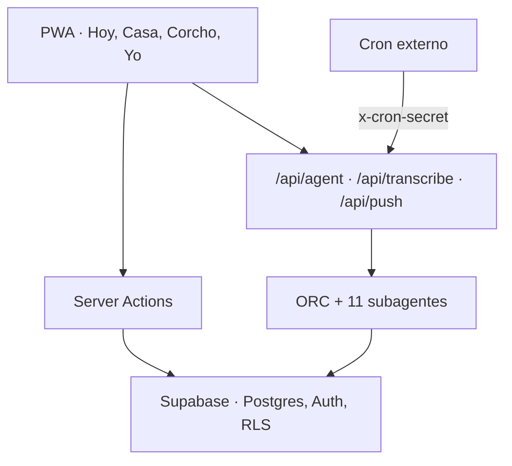

<p align="center">
  
</p>

<h1 align="center">Kore</h1>

<p align="center">
  El sistema operativo de tu hogar.<br />
  Menos carga mental, más calma en casa.
</p>

<p align="center">
  <a href="https://kore-ochre.vercel.app"><strong>Abrir la app</strong></a>
  &nbsp;·&nbsp;
  <a href="#instalar-como-pwa">Instalar como PWA</a>
  &nbsp;·&nbsp;
  <a href="https://github.com/adopico83/kore">GitHub</a>
</p>

<p align="center">
  
  
  
  
  
  
  
  
</p>

---

## Por qué Kore

La vida en casa no cabe en un chat ni en cinco apps sueltas. Kore es una PWA donde la familia ve el día, deja recados y le pide a un orquestador que **actúe**: la compra, la cita, el cole o el menú se escriben en la base de datos del hogar.

Cada familia tiene su espacio. La IA no inventa el estado de la casa: consulta y actualiza lo que ya está guardado.

- Un solo sitio para el día, la casa y los recados.
- Voz o texto: Kore ejecuta, no solo responde.
- Los cambios se ven al momento, sin recargar.

## Qué hace

Cuatro pestañas: **Inicio** (en escritorio, **Hoy**), **Casa**, **Corcho** y **Yo**, más el botón del orquestador.

| | |
|---|---|
| 🏠 **Hoy** | Saludo, agenda del día y pendientes cortos (compra, limpieza). |
| 🏡 **Casa** | Colegio, limpieza, sueño, compras, menú, salud, economía y tiempo libre. |
| 📌 **Corcho** | Recados entre adultos. Vale una nota de solo texto o solo foto, hasta 6 JPEG. |
| 🩺 **Salud** | Citas y medicación. Una cita crea, edita o borra el evento de agenda enlazado, así que aparece en Hoy. |
| ✨ **ORC** | Un orquestador con **11 subagentes**. Escribes o hablas; las tools tocan la base de datos. |
| ⚡ **Al momento** | Supabase Realtime y el evento local `kore-update` refrescan la UI en cuanto hay un cambio. |
| 🔒 **Tu hogar** | Registro, onboarding e invitación por código. RLS cerrado por familia. `/api/transcribe` exige sesión antes de llamar a Whisper. |
| 🔔 **Avisos** | Web Push (VAPID). Un cron externo llama a `/api/push` y, si hay algo relevante, envía el resumen del día. |

## Instalar como PWA

La app en producción es [kore-ochre.vercel.app](https://kore-ochre.vercel.app). El manifest usa `display: standalone`.

1. Abre la URL en el móvil.
2. **Android (Chrome):** menú → *Instalar aplicación* o *Añadir a pantalla de inicio*.
3. **iPhone (Safari):** Compartir → *Añadir a pantalla de inicio*.

En el escritorio, el navegador ofrece instalarla cuando el manifest y el service worker están activos.

---

## Para quien mira el código

Next.js 16.2.4 (App Router) · React 19.2.4 · TypeScript 5 · Tailwind CSS 4 · Supabase (`@supabase/supabase-js` ^2.105.1, Auth, Postgres, RLS, Storage) · OpenAI ^6.35.0 (chat y function calling) · Vitest ^4.1.5 · desplegado en Vercel.

<details>
<summary><strong>Arquitectura</strong></summary>



```
src/
├── app/                  # page, HomeClient, login, register, onboarding, admin
│   └── api/              # agent, push, transcribe
├── components/           # home/, domain-panels/, CorchoChat, AgentChat, modales
├── lib/
│   ├── agents/           # orchestrator + 11 subagentes
│   ├── agent/            # guardrails del plan de tools
│   ├── actions/          # Server Actions por dominio
│   ├── kore-db.ts        # única capa de queries
│   └── supabase/         # browser, server, admin
└── __tests__/            # 24 archivos, 128 tests
```

Tres clientes de Supabase, cada uno en su sitio: el del navegador respeta RLS, el de servidor también, y `createAdminClient()` solo corre en servidor después de validar la sesión y el `familyId`.

</details>

<details>
<summary><strong>ORC y 11 subagentes</strong></summary>

`POST /api/agent` resuelve la familia, carga memoria y un snapshot del hogar, y llama a OpenAI con las tools de los 11 módulos de `src/lib/agents/`. `executeTool` enruta al subagente. Los [guardrails](src/lib/agent/guardrails.ts) filtran el plan antes de ejecutarlo: una mutación por dominio salvo listas explícitas, lecturas al final, y el evento escolar emparejado con la agenda.

| Subagente | Se ocupa de |
|-----------|-------------|
| Agenda | Eventos del calendario familiar |
| Colegio | Eventos escolares y material, sincronizados con la agenda |
| Compras | Lista de la compra |
| Limpieza | Tareas por zona y frecuencia |
| Menú | Plan semanal de comidas |
| Sueño | Sesiones, despertares y resumen |
| Tiempo libre | Ocio y tiempo personal |
| Salud | Citas y medicación; la cita queda enlazada a la agenda |
| Corcho | Notas entre adultos |
| Economía | Gastos del hogar |
| Memoria | Hechos persistentes en `agent_memory` |

El audio pasa por `POST /api/transcribe` (Whisper). Sin sesión familiar responde 401 y no llama al modelo.

</details>

<details>
<summary><strong>Datos y seguridad</strong></summary>

Tablas en Postgres (tipos generados en `src/types/database.ts`): `families`, `profiles`, `domains`, `calendar_events`, `school_events`, `school_materials`, `shopping_items`, `cleaning_tasks`, `menu_items`, `sleep_sessions`, `sleep_logs`, `health_records`, `daily_metrics`, `leisure_activities`, `expenses`, `kore_notes`, `kore_note_images`, `kore_notifications`, `agent_memory`, `agent_messages`, `conversations`, `messages`, `push_subscriptions`, `events_log`, `domain_history`.

Las fotos del Corcho viven en Storage, con rutas firmadas y acotadas a la familia. La migración que cierra el RLS revoca el rol `anon` y deja el acceso por `get_my_family_id()`. El service role no sustituye esa regla: las escrituras del servidor comprueban antes la sesión.

`/admin` solo se abre si el email de la sesión coincide con `KORE_ADMIN_EMAIL`.

</details>

<details>
<summary><strong>Variables de entorno</strong></summary>

Crea `.env.local` en la raíz. No hay `.env.example` en el repo. Las mismas claves van en Vercel (Production y Preview). Nada sin prefijo `NEXT_PUBLIC_` llega al navegador.

```env
NEXT_PUBLIC_SUPABASE_URL=https://xxxx.supabase.co
NEXT_PUBLIC_SUPABASE_ANON_KEY=
SUPABASE_SERVICE_ROLE_KEY=

OPENAI_API_KEY=

NEXT_PUBLIC_VAPID_PUBLIC_KEY=
VAPID_PRIVATE_KEY=
VAPID_SUBJECT=mailto:tu@email.com

CRON_SECRET=
```

| Variable | Uso |
|----------|-----|
| `NEXT_PUBLIC_SUPABASE_URL` | URL del proyecto |
| `NEXT_PUBLIC_SUPABASE_ANON_KEY` | Cliente del navegador, con RLS |
| `SUPABASE_SERVICE_ROLE_KEY` | Actions, API y agentes. Solo servidor |
| `OPENAI_API_KEY` | ORC, subagentes y Whisper |
| `NEXT_PUBLIC_VAPID_PUBLIC_KEY` | Alta de la suscripción push |
| `VAPID_PRIVATE_KEY` | Firma de las notificaciones |
| `VAPID_SUBJECT` | Contacto VAPID (`mailto:` o URL de la app) |
| `CRON_SECRET` | Header `x-cron-secret` en `/api/push` |
| `KORE_ADMIN_EMAIL` | Quién puede entrar en `/admin` |
| `NEXT_PUBLIC_KORE_ADMIN_EMAIL` | Muestra el enlace de admin en Yo |

Opcional, solo para el aviso de sueño (`supabase/functions/kore-sleep-check`): `PUSHOVER_API_TOKEN` y `PUSHOVER_USER_KEY`.

</details>

<details>
<summary><strong>Arranque local</strong></summary>

```bash
git clone https://github.com/adopico83/kore.git
cd kore
npm install
# crea .env.local con las variables de arriba
npm run dev
```

Abre [http://localhost:3000](http://localhost:3000).

| Comando | Qué hace |
|---------|----------|
| `npm run dev` | Servidor de desarrollo |
| `npm run build` | Build de producción |
| `npm run start` | Sirve el build |
| `npm test` | Vitest en watch |
| `npm run test:run` | Vitest, una pasada |
| `npm run lint` | ESLint |

La suite de Vitest incluye `src/**/*.{test,spec}.{ts,tsx}`: **128 tests en 24 archivos** (agente, guardrails, Corcho, salud↔agenda, hogar, push y admin).

</details>

<details>
<summary><strong>Despliegue</strong></summary>

| Servicio | Rol |
|----------|-----|
| **Vercel** | App Next.js y rutas `/api/agent`, `/api/push`, `/api/transcribe`. Producción: [kore-ochre.vercel.app](https://kore-ochre.vercel.app) |
| **Supabase** | Postgres, Auth, RLS, Storage del Corcho y la función `kore-sleep-check` |
| **Cron externo** | `POST /api/push` con `x-cron-secret` para el resumen diario |

Un push a `main` despliega en Vercel. El service role no sale del servidor.

</details>

## Autor

[adopico83](https://github.com/adopico83) · [LinkedIn](https://linkedin.com/in/ander-dopico)

## Licencia

Código visible con fines de portfolio. Todos los derechos reservados; escríbeme si quieres usarlo.

---

<p align="center"><em>Kore no sustituye el criterio de la familia: lo amplifica.</em></p>
